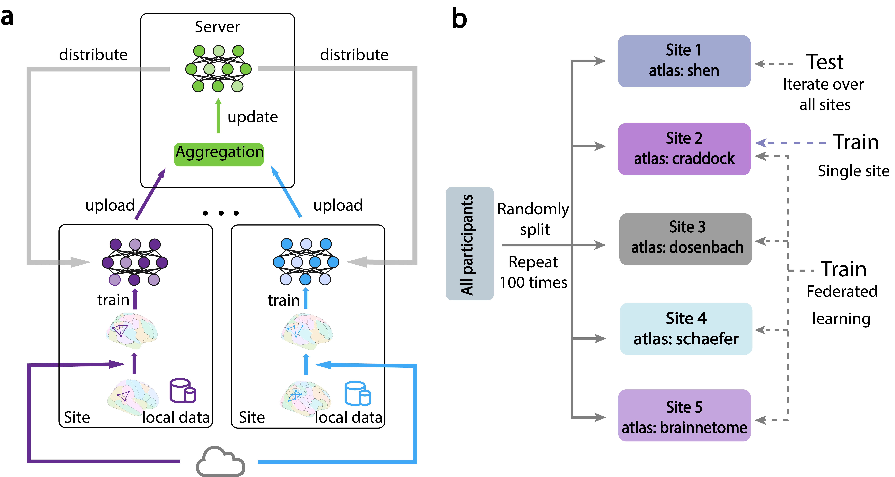

# Federated-learning across sites with connectomes across atlases

## Method

Federated learning framework and experimental setup for sites with connectomes from different atlases. a, Initially, connectomes are locally transformed into the target atlas using online mapping resources. The local models, trained on the transformed data, are subsequently aggregated on the server and distributed back to the local nodes for updates. b, the participants are divided into five partitions (sites) randomly, each of equal size. Different atlases are utilized at each site. One site is designated as the testing set, while the remaining four serve as the training set. We conducted a comparative analysis between the federated learning model trained on data from all four sites and models trained independently on each site. The whole process was repeated 100 times.

## Dependencies
- python 
- pytorch
- scikit-learn
- numpy

## Data
All the data should be configured in ./data/, all files should be name as {atlas}_{task}.mat

## Experiment 

### Federated learning
```
python federated.py -t shen -task qa_pass
```

### Baseline comparison (single site)
```
python federated_site.py -t shen -task qa_pass
```


